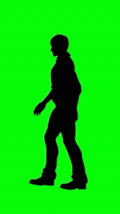

<div align="center">
  
  <h1>HOOD IRONY ON YOUR DESKTOP</h1>
  <p><b>Throw it, watch it, do whatever you want with it.</b></p>
  <p>
    
    
    
    
  </p>
</div>

---

A tiny Windows desktop pet: the black silhouette from the **hood irony** meme
(a green-screen video) strolls along your screen and randomly blurts out meme
sounds. Grab it, fling it, let it bounce off the walls.

> The pet literally *is* a vertical video walking around your desktop.
> The green screen is a feature, not a bug.

## Features

- walk
- stand
- fly

## Run from source

```powershell
cargo run --release
```

Requires Rust with the MSVC toolchain. FFmpeg is pulled in automatically by
`ffmpeg-sidecar`; if it is already installed on the system, that one is used.

## Build

```powershell
cargo build --release
```

Binary: `target/release/hood-irony-desktop.exe`

## Assets

| Folder | What to put there |
|---|---|
| `assets/video/` | `pet.mp4` — the pet video (loops automatically) |
| `assets/sounds/` | `*.mp3` / `*.wav` — sounds, `hit_*` for landings |
| `assets/icon.png` | tray icon (64×64) |

See [docs/ASSETS.md](docs/ASSETS.md).

## Configuration

`config.toml` is created next to the exe on first run (in the project root in
debug builds). It can also be edited live in the Settings window.
See [docs/CONFIG.md](docs/CONFIG.md).

## Right-click the tray icon

- **Pause** — the pet stops moving and animating
- **Settings** — size, speeds, sound interval, volume, chroma key
- **Quit** — closes the pet

## Documentation

- [docs/ARCHITECTURE.md](docs/ARCHITECTURE.md) — architecture, crates, state machine
- [docs/ROADMAP.md](docs/ROADMAP.md) — development stages and status
- [docs/ASSETS.md](docs/ASSETS.md) — video and sound requirements
- [docs/CONFIG.md](docs/CONFIG.md) — config options
- [docs/TRICKS.md](docs/TRICKS.md) — Windows/egui pitfalls and fixes

## Roadmap

- **v0.3** — walk on top of window title bars and the taskbar (real shimeji),
  fall/jump off when a window moves or closes
- Later — click reactions, multiple video costumes, launch on startup

## Notes

Windows Smart App Control (and some real-time antivirus tools) block unsigned
executables; if the build or the exe is blocked, turn SAC off / add the project
folder to your AV exclusions. See [docs/TRICKS.md](docs/TRICKS.md).

## License

[MIT](LICENSE) — do whatever you want with it.
